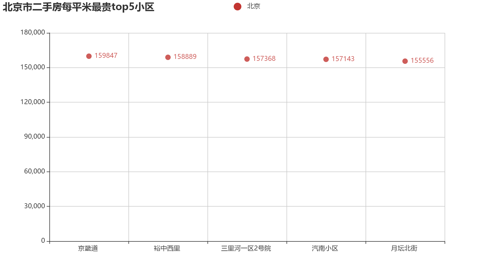
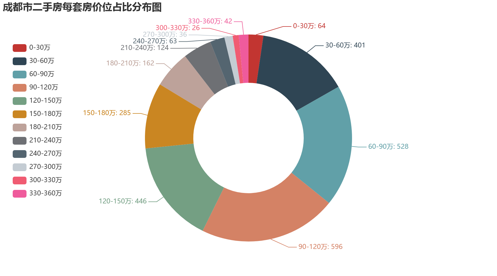
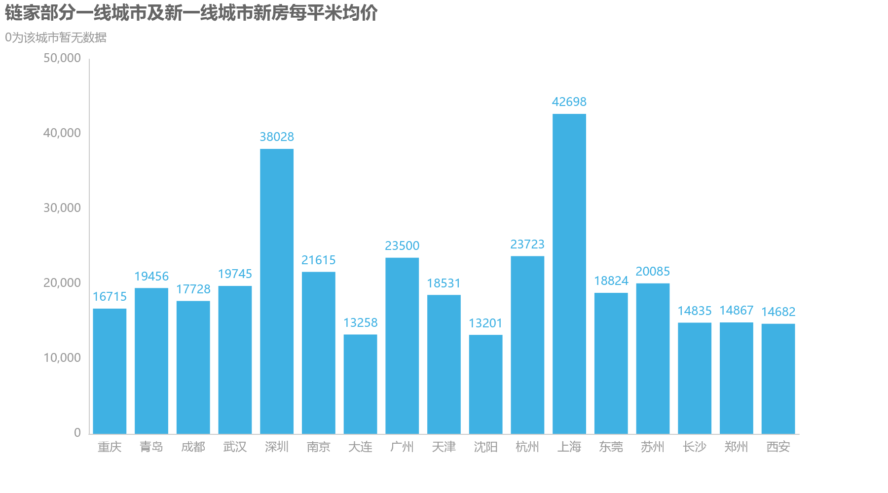
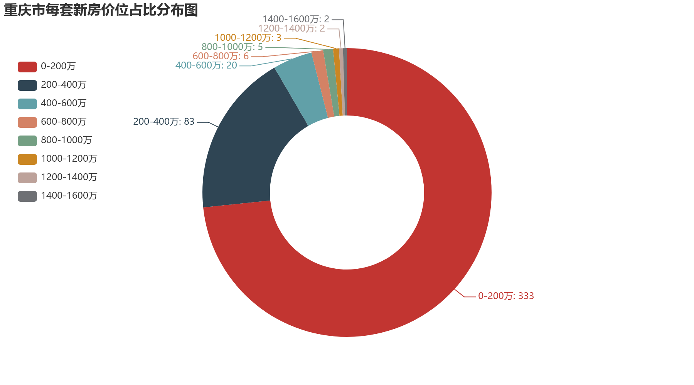
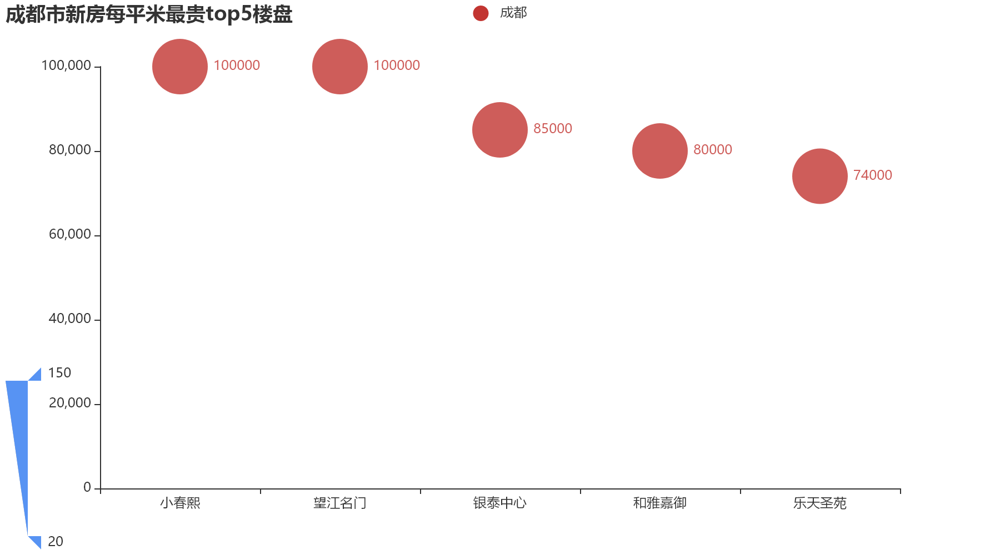
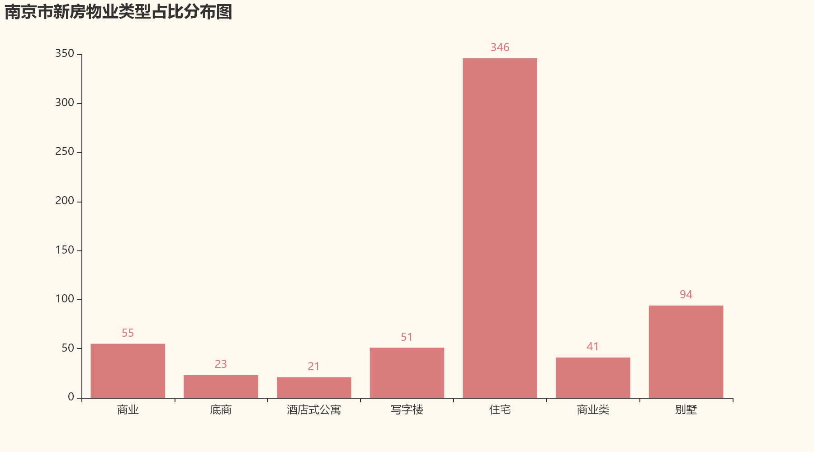
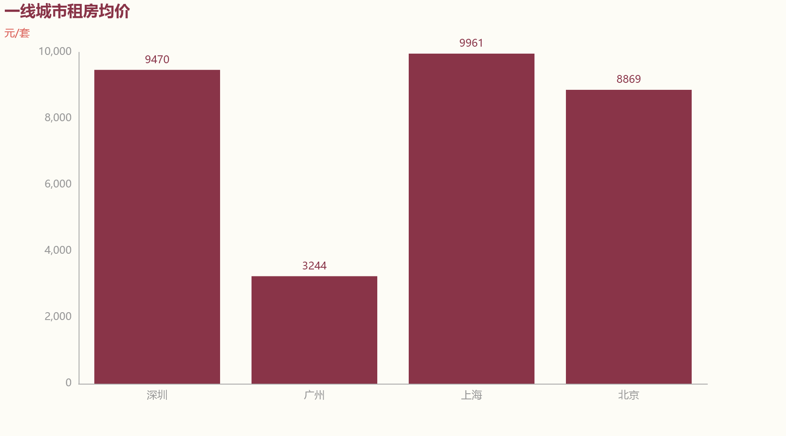
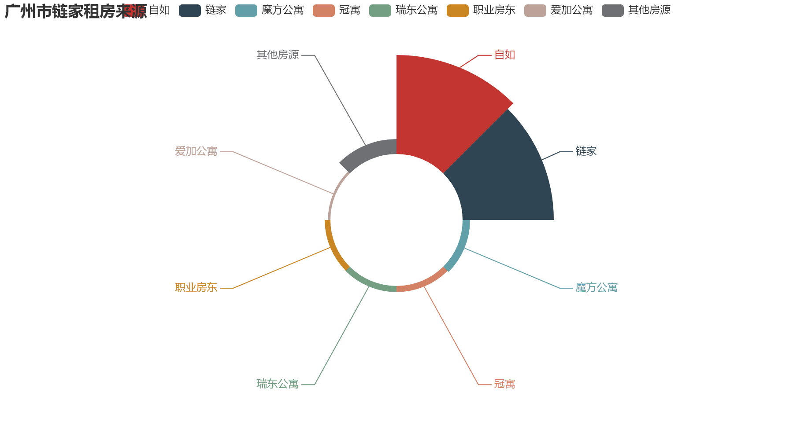

- 链家房产数据爬取分析可视化平台
    - 该平台主要分为三个模块
        - 数据爬取模块
        * 使用scrapy框架对链家的新房，二手房，租房数据进行爬取，存入MongoDB和Elasticsearch数据库
        *  data_visualize模块聚合MongoDB进行数据分析后，利用pyecharts生成图表保存到本地
        * 通过flask实现数据的网站展示
---
+ 项目运行步骤：
+ 安装依赖的python包
+ pip install -r requirements.txt
+ 运行GraduationProject目录的run.py,即可运行项目
+ data_visualize目录为数据分析模块代码
+ lianjia为网站显示模块
+ spider为爬虫模块
+ config目录为项目的配置文件
---
+ 数据分析视角
---
+ 新房
    1. main_price各区间分布
    2. second_price各区间分布
    3. 每平米均价
    4. 每套均价
    5. 每平米最贵top5
    6. 每平最低top5
    7. 物业类型占比分布
    8. 户型分布情况
    9. tag词云

---

+ 二手房
    * 每平米均价
    * 每套均价
    * 每平米价格区间分布
    * 每套价格区间分布
    * 每平米最贵top5
    * 每套最贵top5
    * 小区名词云
    * position词云
---
+ 租房
    * 每个品牌房源占比
    * 每套房租房均价
    * 每套最贵top5
    * 每套最低top5
    * tag词云
---
+ 数据可视化模块通过pyecharts读取数据进行图表渲染
## 数据可视化图表如下:
* 二手房

.gif)

* 新房

* 租房

